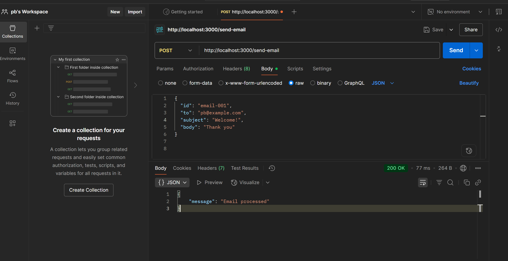
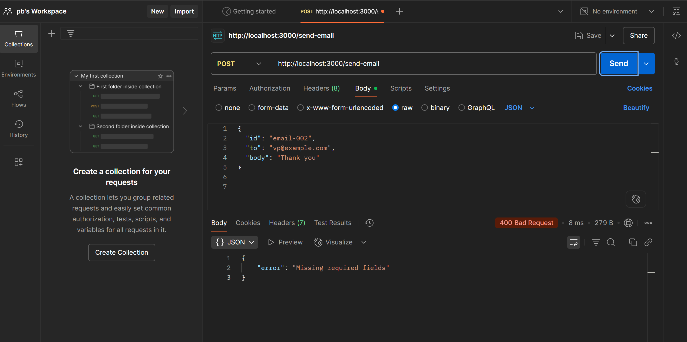
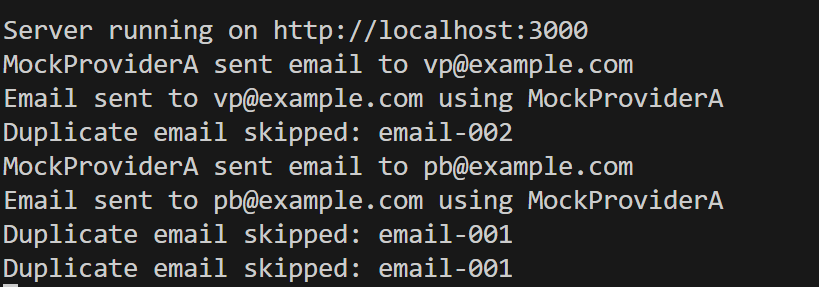

# Email Service

## Description
The Email Service API allows users to send emails reliably using multiple providers. It features retry logic, provider fallback, rate limiting, idempotency to avoid duplicates, and tracks the status of each email sent.


The Email Service project is a backend API designed to send emails reliably through multiple mock email providers. It ensures that emails are delivered even if one provider fails, by implementing retry logic with exponential backoff and automatic fallback between providers. To avoid sending duplicate emails, the service supports idempotency by tracking unique email IDs. Additionally, it includes basic rate limiting to prevent overwhelming the providers and maintains detailed status tracking for each email sent, making it easier to monitor and debug email delivery.

The API exposes a key endpoint, `/send-email`, which accepts POST requests containing the email details: a unique `id`, the recipient’s email address (`to`), the email `subject`, and the `body` content. When a request is received at this route, the service validates the input, then attempts to send the email using the available providers. If sending fails with one provider, the service automatically retries with exponential delays and switches to fallback providers as needed. This route responds with a success message once the email is processed or returns an error if any required fields are missing or if the sending process fails after all retries.

Overall, this project demonstrates a resilient and fault-tolerant email sending backend that can be integrated with frontend applications or other services. It focuses on ensuring reliable delivery and ease of monitoring, making it suitable for applications where email communication is critical.


## Installation
1. Clone the repository:
   ```bash
   git clone <repository-url>
   ```
2. Navigate to the project directory:
   ```bash
   cd Email_Service
   ```
3. Install dependencies:
   ```bash
   npm install
   ```
4. Run Server
    ```bash
    npm start
    ```
## Testing the API with Postman Example




## API Endpoints
   http://localhost:3000/send-email

## Technologies Used
- Typescript
- Node.js
- Express
- Postman (Testing)

